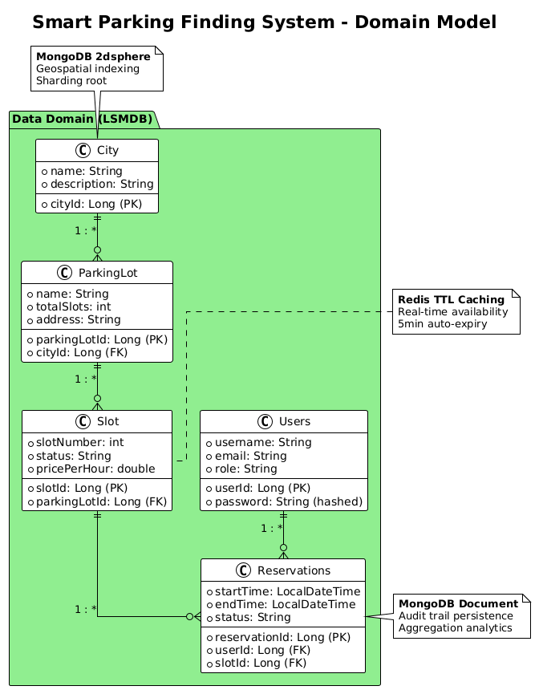
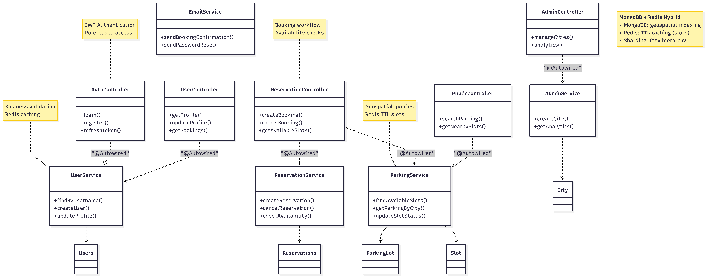
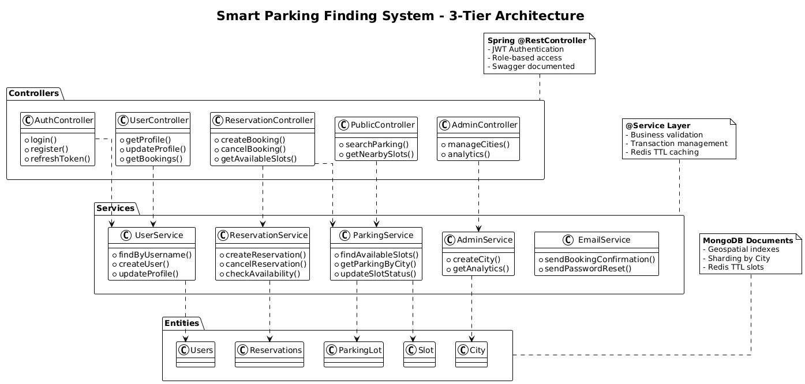

# Smart-Parking-Finding-System
The Smart Parking Finder System (SPFS) is a modern, scalable two-sided platform designed to alleviate urban congestion by providing real-time information on parking slot availability. The Mobile User Interface serves the end-user, enabling them to quickly search for, view details of, and reserve an available parking slots.

## **Project Overview**
​
SPFS manages city-wide parking reservations using polyglot persistence:

MongoDB: Persistent storage, analytics, geospatial queries (50MB Seattle data)
Redis: Real-time availability, atomic booking, TTL session locks (4hr expiry)

Key Goals Achieved:

- Volume: 50MB+ Seattle parking dataset (lots + 200K reservations)
- Velocity: IoT sensor simulation (5-10 updates/sec via Redis)
- Variety: Documents (MongoDB) + Key-Value (Redis)

## **Architecture Overview**
​
The Smart Parking Finder System (SPFS) follows a layered, service-oriented architecture designed to satisfy the volume, velocity, and variety requirements of the Large Scale and Multi-Structured Databases course. At a high level, the backend is built with Spring Boot and exposes REST APIs that are consumed by a web/mobile client, while MongoDB and Redis together implement a polyglot persistence layer.
​
At the application layer, a set of controllers (AuthController, UserController, ReservationController, AdminController, PublicController, AnalyticsController) receive HTTP requests, enforce authentication and authorization, and delegate all business logic to dedicated service classes (UserService, ParkingService, ReservationService, AdminService, EmailService). These services encapsulate the main use cases of the system: user registration and login, hierarchical search of parking lots by city and zone, real-time availability checks, reservation creation and cancellation, and administrative analytics over historical usage.
​
The persistence layer combines MongoDB and Redis with clearly separated responsibilities. MongoDB stores long-lived, structured documents for users, parking lots, slots, and reservations, and is configured to support hierarchical, city/zone-based sharding so that queries for a given city or zone can be routed to the relevant shard only. This enables the system to scale with the 50MB+ Seattle parking dataset and beyond, while still supporting complex aggregation queries such as "top busiest zones" or "hourly usage trends".
​
Redis is used as a high-velocity, in-memory layer that handles real-time availability and concurrency control. Slot availability counters and sets of reserved slot IDs are maintained in Redis, and core reservation operations rely on atomic commands (such as DECR, SCARD, and SPOP) combined with per-user TTL keys to prevent double booking and to automatically expire active reservations after a fixed time window. This design allows the system to absorb a simulated IoT workload of 5–10 updates per second while keeping user-facing read operations low-latency.
​
To support maintenance and consistency, a scheduled component (ReservationCleanupScheduler) periodically scans for expired or inconsistent reservations and reconciles Redis state with MongoDB, ensuring that the cache and the document store converge over time. Deployment is planned around a small distributed setup: multiple VMs or containers run a MongoDB replica set with zone-based sharding, a Redis master–replica pair for fault-tolerant caching, and the Spring Boot application plus an external Python IoT simulator that drives high-velocity updates during demonstrations.
​
## **Features**

- Hierarchical Search: City → Zone → Lot (compound indexes)
- Atomic Reservations: Redis DECR + SPOP prevents double-booking
- Real-time Availability: SCARD lot:reserved:{lotId} + capacity check
- TTL Session Locks: user:active:res:{userId} (4hr auto-expiry)
- Admin Analytics: MongoDB aggregation (top 3 busiest zones)
- Seattle Data: 50MB+ real parking transactions

## **Key Features**

- **Real-time slot availability** (Redis TTL caching)
- **Geospatial search** (MongoDB 2dsphere indexes)
- **JWT Authentication** + Role-based access (USER/ADMIN)
- **Reservation lifecycle** (PENDING -> CONFIRMED -> COMPLETED)
- **City -> ParkingLot -> Slot hierarchy** (sharding ready)
- **Automated cleanup** (ReservationCleanupScheduler)
- **Swagger API docs** (`/swagger-ui.html`)

## **Tech Stack**

Backend: Spring Boot 3.2 + Java 17 + MongoDB + Redis
Frontend: Angular 17 (separate repo planned)
Security:    JWT + Spring Security (ROLE_USER/ROLE_ADMIN)
API Docs: Swagger OpenAPI 3  `/swagger-ui.html`
Deployment: Docker Compose ready (3VM cluster)

## **Quick Start**

### **Prerequisites**

Java 17+ | MongoDB 7.0 | Redis 7.2 | Node.js 18+ (frontend)

### **1. Clone & Backend**

git clone https://github.com/19mohsin58/Smart-Parking-Finding-System
cd Smart-Parking-Finding-System
cp .env.example .env

Edit .env: MONGO_URI, REDIS_HOST, JWT_SECRET
mvn spring-boot:run

### **2. API Endpoints**

Auth: POST /api/auth/login, /api/auth/register
User: GET /api/user/profile, GET /api/user/bookings
Public: GET /api/public/search?city=Rome&lat=41.9&lng=12.5
Reservation: POST /api/reservation/book, DELETE /api/reservation/{id}
Admin: POST /api/admin/city, GET /api/admin/analytics
Swagger: http://localhost:8080/swagger-ui.html

## **Data Architecture**

**Polyglot Persistence:**

MongoDB: Persistent storage + geospatial queries + sharding (City->Lot->Slot)
Redis: Real-time slot availability (TTL caching, 5min expiry)

## **UML Class Diagram Documentation**

- [Data Domain Model (source as Mermaid format)](documents/uml-class-diagram-domain-model.md)

- [Data Domain Model (source as PlantUML format)](documents/uml-class-diagram-domain-model.puml)

- [3-Tier Architecture (source Mermaid format)](documents/uml-class-diagram-3-tier-architecture.md)

- [3-Tier Architecture (source as PlantUML format)](documents/uml-class-diagram-3-tier-architecture.puml)

## **Other Documentation**

- [API Reference](http://localhost:8080/swagger-ui.html) <-- I am still working on this.
- [Deployment Guide](documents/DEPLOYMENT.md) <-- I am still working on this.

## **Course Alignment (Large Scale DBs)**

- **Sharding**: City -> ParkingLot -> Slot hierarchy
- **Polyglot**: MongoDB (documents) + Redis (key-value and TTL)
- **Geospatial**: 2dsphere indexes for radius searches
- **Real-time**: Redis pub/sub + WebSocket ready
- **Analytics**: MongoDB aggregation pipelines

## **Contributing**

git clone https://github.com/19mohsin58/Smart-Parking-Finding-System
mvn clean install
